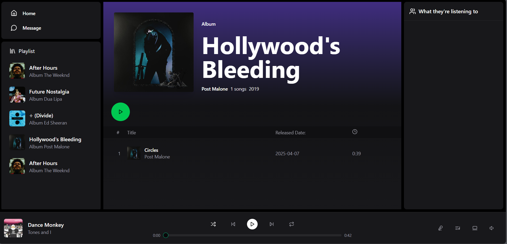

# 🎵 Spotify Clone – Fullstack Music Streaming App

[](https://spotify-clone-black-theta.vercel.app)
[](https://spotify-clone-2j8a.onrender.com)
[](#-license)

A modern, fullstack music streaming platform built with **React**, **Clerk**, **Zustand**, **Socket.io**, **Vite**, and a **Node.js/Express backend**. Enjoy real-time music activity, chat with friends, and manage a library of songs and albums.

---

## 🔗 Live Demo

- 🎧 Frontend: [spotify-clone.vercel.app](https://spotify-clone-black-theta.vercel.app)
- 🛠 Backend API: [render backend URL](https://spotify-clone-2j8a.onrender.com)

---

## 🚀 Features

### 🎧 Music Playback
- Play, pause, skip, shuffle, repeat
- Volume control & buffering indicator
- Queue management
- Playback persists across views

### 👥 Authentication & Authorization
- OAuth login with Google (via Clerk)
- Route protection for users and admins
- Admin dashboard to manage content

### 📚 Music Catalog
- View albums and songs
- Upload & delete albums and tracks (Admin only)
- Audio + image upload with preview

### 💬 Real-Time Chat
- One-to-one messaging via WebSockets
- Online user status
- Friend activity (shows what song a user is listening to)

### 💅 Modern UI/UX
- Responsive layout with resizable panels
- Skeleton loaders
- Dark mode with CSS variables
- Animations and hover transitions

---

## 🖼 Screenshots

| Home Page | Admin Panel | Album View | Chat |
|----------|-------------|------------|------|
|  |  |  |  |

---

## 🛠 Tech Stack

- **Frontend:** React, TypeScript, Vite, Tailwind CSS
- **State Management:** Zustand
- **Auth:** Clerk
- **Backend:** Node.js, Express, MongoDB
- **Real-Time:** Socket.io
- **Styling:** Tailwind, tw-animate-css
- **Routing:** React Router
- **UI Libraries:** Lucide Icons, ShadCN Components

---

## 📦 Installation

### 1. Clone the repo

```bash
git clone https://github.com/DenislavaVM/spotify-clone.git
cd spotify-clone
```

---

### 2. Setup Frontend

```bash
cd frontend
npm install
```

Create a `.env.local` file in the `frontend/` directory:

```env
VITE_CLERK_PUBLISHABLE_KEY=<Your Clerk publishable key>
VITE_BACKEND_URL=https://spotify-clone-2j8a.onrender.com

VITE_CLERK_SIGN_IN_URL=/sso-callback
VITE_CLERK_SIGN_UP_URL=/sso-callback
VITE_CLERK_SIGN_IN_FORCE_REDIRECT_URL=/auth-callback
VITE_CLERK_SIGN_UP_FORCE_REDIRECT_URL=/auth-callback
VITE_CLERK_AFTER_SIGN_OUT_URL=/
```

---

### 3. Setup Backend

```bash
cd ../backend
npm install
```

Create `.env` in the `backend/` folder:

```env
PORT=5000
MONGODB_URI=<Your MongoDB URI>
ADMIN_EMAIL=<Your admin email>

CLOUDINARY_API_KEY=<Your Cloudinary API key>
CLOUDINARY_API_SECRET=<Your Cloudinary secret>
CLOUDINARY_CLOUD_NAME=<Your Cloudinary name>

NODE_ENV=production
CLERK_PUBLISHABLE_KEY=<Your Clerk publishable key>
CLERK_SECRET_KEY=<Your Clerk secret key>

CORS_ALLOWED_ORIGINS=http://localhost:5173,https://your-backend-url.com,https://your-frontend-url.com
```

> ⚠️ Make sure your MongoDB cluster is active and accessible, and that the `MONGODB_URI` is correctly configured.
---

## 🧪 Development

### 1. Start the Backend

Make sure you're in the project root, then run:

```bash
cd backend
npm run dev
```

The **backend server** will start on `http://localhost:5000` by default.

---

### 2. Start the Frontend

Make sure you're in the project root, then run:

```bash
cd frontend
npm run dev
```

> ✅ Ensure both the frontend and backend are running concurrently for the full application to function correctly.

## 📤 Build for Production

```bash
cd frontend
npm run build
```

This creates the optimized build in the `dist/` folder.

---

## 🧠 Future Improvements

- Search functionality
- Playlist support
- Like/favorite system
- Better mobile chat UX
- S3 or Firebase Storage for uploads

---

## 🙌 Acknowledgements

Inspired by Spotify’s design and user experience.

Built using:

- [Clerk.dev](https://clerk.dev/)
- [Socket.io](https://socket.io/)
- [Zustand](https://zustand.dev/)
- [TailwindCSS](https://tailwindcss.com/)
- [Lucide Icons](https://lucide.dev/)

---

## 📄 License

MIT License © 2025 [Denislava Milanova](https://github.com/DenislavaVM)

See [`LICENSE`](./LICENSE) for full text.